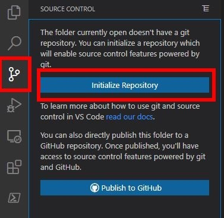
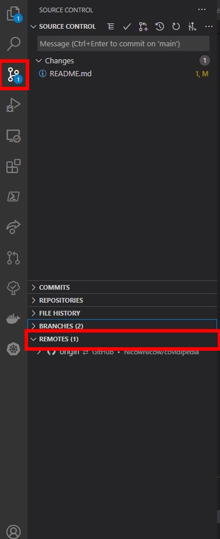
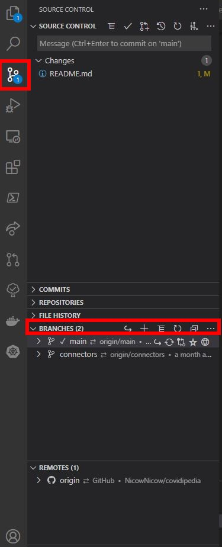

# Covidipedia: Manuel d'Installation

Ceci est un manuel détaillant la mise en place d'un environement de développement adapté pour cette application, ainsi que la méthode de création des binaires en vue d'un éventuel déploiement.

## Installation en environnement de développement  

<details><summary>Guide d'installation du SDK .NET Core</summary>
<br>
Ce projet est développé sous l'environement .NET. Plus précisément, le software development kit utilisé est le [.NET Core SDK 3.1.406](https://dotnet.microsoft.com/download/dotnet/3.1), compatible pour Windows, Linux et MacOS.  

Dans une Console de Commande (cmd - bash -powershell):

```powershell linenums="1"
dotnet --version
```

Cette commande permet de vérifier que l'installation a bien fonctionnée. Dans le cas ou la commande n'est pas reconnue, il faut alors redémarer l'ordinateur.

> :heavy_check_mark: **Redémarrage**: Il est recommandé d'avoir au préalable procédé à l'étape d'installation de PostgreSQL avant d'effectuer un redémarrage, cette étape en demandant également un.

---
</details>

<details><summary>Guide d'installation de PostgreSQL</summary>
<br>
  
PostgreSQL est un système d'administration de base de données disponible à [cette addresse](https://www.postgresql.org/download/).

---
</details>

<details><summary>Guide d'installation de Visual Studio Code et de ses extensions</summary>
<br>

L'IDE utilisé lors du développement de ce projet est [Visual Studio Code](https://code.visualstudio.com/). Ci dessous est fournie une liste des extensions de l'IDE importantes utilisées lors du développement de l'application:

* C# Extension, *by Microsoft*
* Docker, *by Microsoft*
* Git Graph, *by mhutchie*
* Git History, *by Don Jayamanne*
* GitHub Pull Requests, *by GitHub*
* gitignore, *by CodeZombie*
* GitLens - Git supercharged, *by Eric Amodio*
* HTML CSS Support, *by ecmel*
* HTML Snippets, *by Mohamed Abusaid*
* IntelliSense for CSS, *by Zignd*
* Kubernetes, *by Microsoft*
* Live Share, *by Microsoft*
* Live Share Whiteboard, *by Jonathan Carter*
* markdownlint, *by David Anson*
* NuGet Gallery, *by pcislo*
* NuGet Package Manager, *by jmrog*
* Powershell, *by Microsoft*
* Remote - WSL, *by Microsoft*
* Todo Tree, *by Gruntfuggly*
* Visual Studio IntelliCode, *by Microsoft*

Aucune de ces extensions n'est obligatoire, cependant leur présence facilite grandement le développement. Elles sont toutes disponibles depuis l'Extension Marketplace de Visual Studio Code.

---
</details>

<details><summary>Guide de préparation du code source via l'extension GitLens Visual Studio Code</summary>
<br>
La première étape consiste à autoriser la connection entre l'extension de Visual Studio et Github. Une fois l'authentification validée, il est désormais temps de pull le repository sur la machine. Pour cela, dans Visual Studio Code:  
<br>
<br>

<br>
<br>
Une fois le repository local initialisé, il faut ajour le repository Github contenant le code source en temps que Remote:
<br>
<br>

<br>
<br>
On renseigne un nom, puis une URL de repository. On crée ensuite une nouvelle branche sur notre repository local:
<br>
<br>

<br>
<br>

On choisit à quelle branche du Github notre branche locale correspondra. Au moment de la création, on choisit alors l'option "Create and Switch". Visual Studio Code est alors prêt à l'utilisation.

---
</details>

<details><summary>Préparamétrage de l'Application</summary><br>

Dans une Console de Commande (cmd - bash -powershell):

```powershell linenums="1"
cd $Path_to_Covidipedia_Front_Folder
dotnet user-secrets init
dotnet user-secrets set SendGridUser Covidipedia
dotnet user-secrets set SendGridKey $SENDGRID_APIKEY
```

Cette manipulation permet d'éviter l'apparitition d'une `API Key Error` au démarrage de l'application.

> :heavy_check_mark: **API Key et Identifiants Administrateurs**: L'API Key SendGrid, ainsi que les identifiants administrateurs de base de l'application sont explicités dans le manuel d'utilisation, livré séparément.

> :warning: **ConnectionString des bases de données**: Lors du développement, il faut penser à adapter les connectionStrings dans le fichier `appsettings.json`. Pour cela, il faut remplacer le nom d'utilisateur et le mot de passe dans les connectionStrings `MainDBConnection` et `ApplicationDbContextConnection` par ceux définis lors de l'installation de PostgreSQL.

---
</details>

<details><summary>Guide de connexion initiale aux bases de données</summary><br>

Les étapes suivantes sont nécessaires uniquement lors du premier paramétrage de l'environement de déploiement sur une machine. A noter qu'elles sont également nécessaire lors du déploiement, s'agissant du build des deux bases de données de l'application.  
<br>

### Connexion initiale à la base de données principale

Dans une Console de Commande (cmd - bash -powershell):

```powershell hl_lines="6" linenums="1"
psql - U $PostgreSQL_Username
$PostgreSQL_Password
CREATE DATABASE bddcovidipedia;
\c bddcovidipedia;
\i $Path_to_scriptBDDindex
\i $Path_to_dataSet
```

La base de données principale est désormais créée et remplie de données utilisables pour tester les fonctionnalités de l'application lors du déploiement.

> :heavy_check_mark: **De l'intérêt de la dernière commande**: La dernière commande permet de remplir la base de données avec des données générées de façon cohérente. Lors d'un déploiement en production, il ne faut donc pas lancer cette commande, les données générées restant fictives.

<br>

### Connexion initiale à la base de données d'authentification

Pour des mesures de sécurité, le système d'authentification est relié à une base de données secondaire, qui doit également être paramétrée.  
Dans une Console de Commande (cmd - bash -powershell):

```powershell linenums="1"
dotnet tool install --global dotnet-ef
dotnet ef database update --context applicationdbcontext
```

Les deux databases sont désormais créées et prêtes à être utilisées.

---
</details>

<details><summary>Guide de lancement des serveurs de tests</summary><br>

Afin de tester l'application/le système de connecteurs, il est tout d'abord nécessaire de lancer le service PostgreSQL.  
Dans une Console de Commande (cmd - bash -powershell):

```powershell linenums="1"
postgres -D $Path_to_PostgreSQL_data_folder
```

L'environement de développement est désormais prêt à l'utilisation.

<br>

<h4><ins> Tester l'Application Web </ins></h4>

Dans une Console de Commande (cmd - bash -powershell):

```powershell linenums="1"
cd $Path_to_covidipedia_front_folder
dotnet run
```

Si la commande `dotnet run` est exécutée dans le dossier où se situe le fichier `covidipedia.front.csproj`, un système d'hosting Microsoft va se lancer. Au bout de quelques secondes, le port du localhost sur lequel est hébergé l'application web sera mis à disposition.

> :warning: **Hosting Microsoft et Cache du Navigateur**: Lorsque le code source de l'application est modifié, il est nécessaire, après sauvegarde des modifications, de relancer le système d'host Microsoft à l'aide la commande `dotnet run` afin que celles ci soient prises en compte. De même, il peut être nécessaire de vider le cache du navigateur lors de la modification des fichiers Javascript et CSS.  

> :heavy_check_mark: **Commande dotnet run**: La commande `dotnet run` permet de tester l'application en cours de développement. Pour cela, des fichiers binaires temporaires sont générés dans les dossiers `/bin/` et `/obj/`. Il est recommandé de rajouter ces dossiers au fichier `.gitignore`, voir de les supprimer avant de procéder à un commit/push.

<br>

<h4><ins> Tester le Système de connecteurs </ins></h4>

Dans une Console de Commande (cmd - bash -powershell):

```powershell linenums="1"
cd $Path_to_covidipedia_connectors_folder
dotnet run
```

Si la commande `dotnet run` est exécutée dans le dossier où se situe le fichier `covidipedia.connectors.csproj`, un système d'hosting Microsoft va se lancer. Au bout de quelques secondes, le service aura terminé la mise à jour de la base de données, et le système d'hosting s'arrêtera de lui même.

> :heavy_check_mark: **Commande dotnet run**: La commande `dotnet run` permet de tester l'application en cours de développement. Pour cela, des fichiers binaires temporaires sont générés dans les dossiers `/bin/` et `/obj/`. Il est recommandé de rajouter ces dossiers au fichier `.gitignore`, voir de les supprimer avant de procéder à un commit/push.

---
</details>

## Création de binaires pour déploiement en production

<br>

Dans une Console de Commande (cmd - bash -powershell):

```powershell linenums="1"
cd $Path_to_covidipedia_folder
dotnet publish -c Release -r $Target_Runtime --self-contained true -p:PublishSingleFile=true /p:PublishTrimmed=true 
```

Lorsqu'exécutée dans le dossier contenant le fichier `Covidipedia.sln`, cette commande permet de créer les binaires et autres fichiers nécessaires pour le déploiement des deux parties du projet (application web et système de connecteurs).  

Explicitons les paramètres de cette commande.

```powershell
dotnet publish
```

Il s'agit le coeur de la commande. Il s'agit de la commande de publication d'exécutables/ de librairies.

```powershell
-c Release
```

Cet argument permet de définir le type de déploiement (Release/Debug).

```powershell
-r $Target_Runtime
```

Cet argument permet de définir l'environement pour lequel le compilateur doit créer les fichiers exécutables. Les environement disponibles sont `win-x64`, `linux-x64` et `osx-x64`. Ainsi, l'environement de déploiement peut être changé à loisir, peu importe l'état d'avancement du projet.

```powershell
--self-contained true
```

Cet argument force le compilateur à inclure le runtime .NET Core dans les fichiers binaires de déploiement. Si cela augmente fortement la taille des fichiers en sortie, cela à pour mérite de ne plus avoir à installer le runtime au préalable sur la machine cible, évitant ainsi des manipulations suplémentaires au client.

```powershell
-p:PublishSingleFile=true
```

Cet argument force le compilateur à combiner les fichiers sources ainsi que les éventuels librairies du runtime (si l'argument `--self-contained true` est présent) en un unique fichier, ce qui permet de simplifier un peu plus l'instalation et la portabilité du programme, au prix d'un fichier au poids plus élevé.

> :heavy_check_mark: **Fichiers de configurations**: Si cette commande force la mise en commun des nombreux fichiers sources, ce n'est pour autant pas le cas des différents fichiers de configuration et autres fichiers statiques, qui resteront séparés du livrable.

```powershell
/p:PublishTrimmed=true
```

Cet argument n'est disponible que si l'argument `--self-contained true` est présent. Il demande au compilateur de n'ajouter au livrable que les dépendances de ce dernier, plutôt que l'intégralité du runtime .NET Core, ce qui permet de réduire la taille du livrable.

<br>

Une fois la commande exécutée, les livrables sont disponibles dans deux dossiers différents (un pour chaque projet de la solution):

* Le système de connecteurs est disponible dans le dossier `covidipedia.connectors/bin/Release/netcoreapp3.1/$Target_Runtime`

* L'application Web est disponible dans le dossier `covidipedia.front/bin/Release/netcoreapp3.1/$Target_Runtime`

> :warning: **ConnectionString des bases de données**: Lors du déploiement, il est **nécessaire** de modifier le système de connectionString.  Premièrement, l'utilisateur PostgreSQL ne doit pas être `postgres`, car c'est le compte administrateur de PostgreSQL.  
Enfin, il ne faut pas laisser les connectionString visibles dans le fichier `appsettings.json`. Il s'agit ici d'une mesure de sécurité. La présence des chaines dans ce fichiers permet une simplicité de développement, mais présente un risque élevé de sécurité si déployé en production. Ainsi, il est nécessaire d'également modifier la méthode d'obtention de ces connectionStrings dans les fichiers `Startup.cs` et `IdentityHostingStartup.cs`
